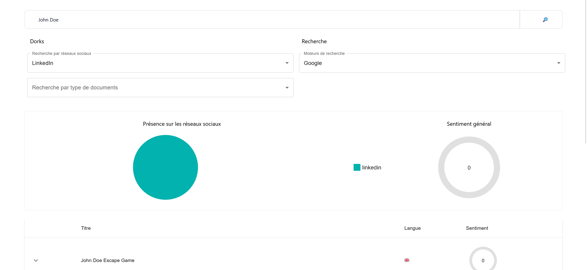

## OSINT

Open Source Intelligence: method of collecting, analyzing, exploiting data from open and publicky accessible sources to obtain relevant information about a specific subject.<br/>
Created in 1942 by the Office of Strategic Services.

### Open Sources
Can include websites, social media, public databases, online forums, public documents, academic publications etc.

### Fields
Security, legal research, investigative journalism etc.

### Techniques
Internet research, geospatial analysis, NLP, mapping etc.

### Goals
Identify potential threats, detect trends, assess risks, support strategic decisions, confirm reports, locate missing persons etc.

### Main concepts
- [x] data collection
- [x] data processing: for instance w/ Pandas, NumPy, Scikit-learn
- [x] data analysis: for instance w/ Matplotlib, Seaborn, TensorFlow
- [x] data sources
- [x] ethics & compliance

## Project

Create a web application that collects data from Twitter via an API, analyzes this data to extract the most popular hashtags, and displays the results in a dashboard.

Project breakdown:
- [x] Back-end: FastAPI
- [x] Front-end: React + TypeScript + Tailwind + Mui
- [x] Dockerized app
- [x] Tests

```
source setup.sh
```

### Demo

#### Basic search

<p align="center">
	
</p>

#### Dorks

##### Social networks

<p align="center">
	
</p>

<p align="center">
	
</p>

##### Filetype

<p align="center">
	
</p>

<p align="center">
	
</p>

### Back-end

FastAPI: 
- [x] web framework created in 2018
- [x] enables to create RESTful API in Python

```
uvicorn main:app --reload
```

#### Endpoints
- [x] Informations: /get_google_infos, /get_duckduckgo_infos, /get_combined_infos
- [x] Sentiments: 
    - [x] by url: /get_sentiments_by_urls or /get_sentiment
    - [x] by query: /get_sentiment_by_query
- [x] Use holehe: /get_holehe_infos

#### TODO
- [x] multi-sources research
- [x] social media integration
- [ ] actuality
- [ ] search by language
- [ ] tests

#### About RESTful API

Architectural style for designing networked applications.
Key characteristics:
- [x] resource-based, e.g. resources are identified by unique URIs -> `/users/{user_id}`
- [x] CRUD Operations: Create (POST), Read (GET), Update (PUT/PATCH), Delete (DELETE)
- [x] Stateless: server does not maintain any client state between requests
- [x] Uniform Interface: w/ standard HTTP methods, status codes, media types for representing data (JSON or XML)
- [x] Hypermedia as the Engine of Application State (HATEOAS)
- [x] Cacheable

### Front-end

```
npm run dev
```

#### Concepts

- [x] décorateurs